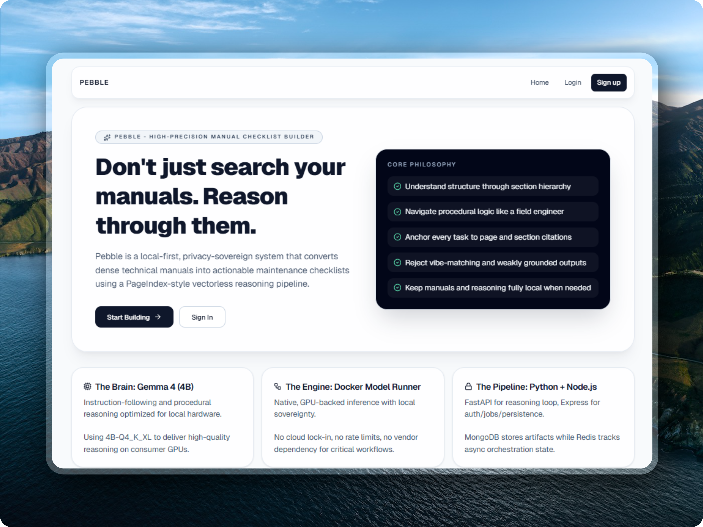

# Pebble


Pebble turns technical manuals into structured, editable checklists with citation-aware AI support.

Reason through manuals, do not just keyword search them.

<div align="center">
  
</div>

## Overview

Pebble helps teams transform dense maintenance and operations documentation into practical, auditable checklist workflows.


## Documentation

- [Docs Index](docs/README.md)
- [Local Setup](docs/setup-local.md)
- [Architecture](docs/architecture.md)
- [API Reference](docs/api-reference.md)
- [Operations Runbook](docs/operations-runbook.md)
- [Troubleshooting](docs/troubleshooting.md)


## Architecture

## Stack

- Frontend: React + Vite (`apps/web`)
- API: Express + TypeScript (`services/api`)
- AI Service: FastAPI (`services/ai`)
- Data: MongoDB + Redis/BullMQ

Request flow:

`Web -> /api/* (Express) -> /v1/* (FastAPI)`

Async checklist jobs:

`Express route -> BullMQ queue -> API worker -> AI pipeline -> MongoDB`

## Features

- Auth (register/login/me)
- Manual upload and management
- Checklist generation jobs with status tracking
- Checklist detail page with item updates
- PDF export for generated checklists
- Per-manual persisted chat history

## Repository Structure

- `apps/web`: React frontend
- `services/api`: Express API + worker
- `services/ai`: FastAPI AI pipeline service
- `docs`: project documentation
- `packages/shared-types`: shared DTO package scaffold

## Quick Start

Requirements:

- Node.js 20+
- npm 10+
- Python 3.11+
- MongoDB
- Redis
- OpenAI-compatible local model endpoint (for example Docker Model Runner)

Install:

```bash
cd apps/web && npm install
cd ../../services/api && npm install
cd ../ai && pip install -r requirements.txt
```

Run (4 terminals):

```bash
# 1) AI service
cd services/ai
uvicorn app.main:app --reload --port 8001
```

```bash
# 2) API service
cd services/api
npm run dev
```

```bash
# 3) Worker service
cd services/api
npm run worker:dev
```

```bash
# 4) Web app
cd apps/web
npm run dev
```

Health checks:

- `GET http://localhost:4000/health`
- `GET http://localhost:4000/health/deps`
- `GET http://localhost:8001/health`


